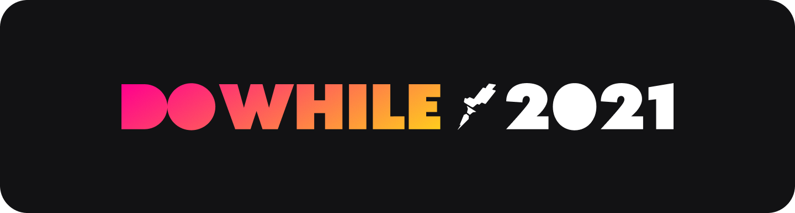
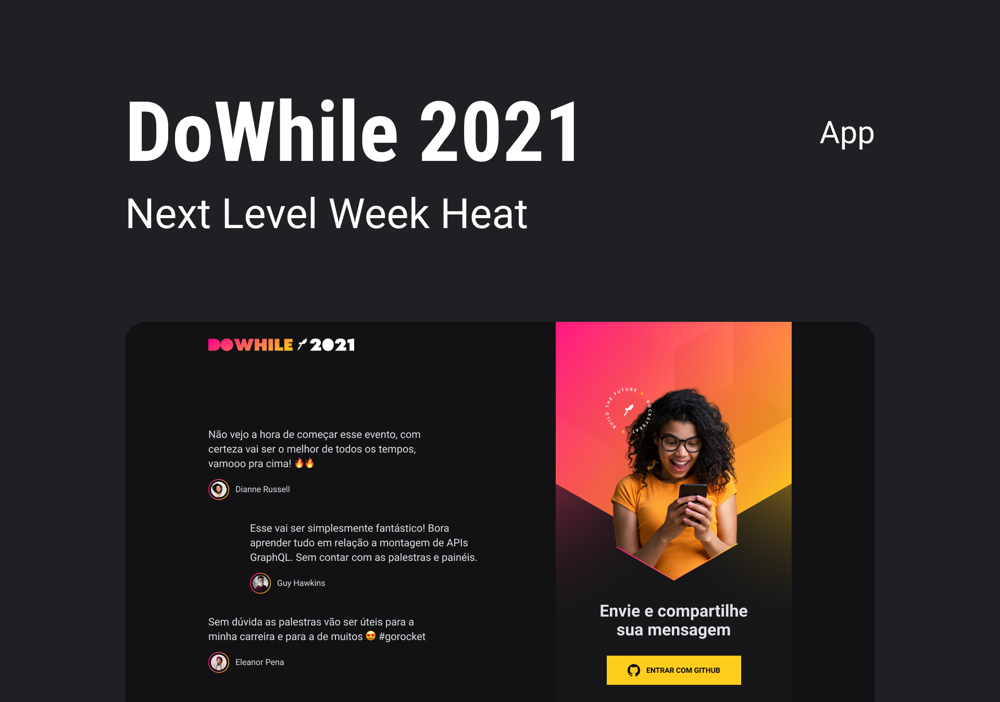

<h1 align="center">
    
</h1>

  

  

  <a href="#-nlw">NLW</a>&nbsp;&nbsp;&nbsp;|&nbsp;&nbsp;&nbsp;
  <a href="#-project">Project</a>&nbsp;&nbsp;&nbsp;|&nbsp;&nbsp;&nbsp;
  <a href="#rocket-Technologies">Technologies</a>&nbsp;&nbsp;&nbsp;|&nbsp;&nbsp;&nbsp;
  <a href="#-layout">Layout</a>&nbsp;&nbsp;&nbsp;|&nbsp;&nbsp;&nbsp;
  <a href="#-how-to-use">How to use</a>&nbsp;&nbsp;&nbsp;|&nbsp;&nbsp;&nbsp;
  <a href="#-how-to-contribute">How to contribute</a>&nbsp;&nbsp;&nbsp;|&nbsp;&nbsp;&nbsp;
  <a href="#memo-license">License</a>

  

## ☕ What's Next Level Week?

NextLevel Week (NLW) is a Rocketseat event that seeks to help programmers reach their next level in the world of programming. The event uses a lot of practice (hand on code), challenges and networking. A completely free online event that will help you take the next step in your evolution as a developer.

 

## 💻 Project

The project allows people to write messages saying what their expectations are for the Rocketseat event called Do While

 

## 🛠️” Technologies

This project was developed with the following technologies:

- Node.js
  - Koa
  - SocketIO
  - Prisma
- TypeScript

 

## 🔖 Layout

Access the layout in [Figma](<https://www.figma.com/file/GfMrGymDY9fU1CFfig9lJy/%5BNLW-Heat---Mission%3A-Impulse%5D-DoWhile2021-(Community)?node-id=0%3A1>).

 

## ⚙️ How To Run

Follow the steps below to run this project

- Clone o repository with `git clone https://github.com/devweslen/nlw-heat`;
- Install all dependencies with `yarn`;
- Change environments variables `.env.example`;
- Start the dev server with `yarn dev`.

 

## 🤔 How to contribute

- Make a fork;
- Create a branch with your feature: `git checkout -b my-feature`;
- Commit changes: `git commit -m 'feat: My new feature'`;
- Make a push to your branch: `git push origin my-feature`.
  After merging your receipt request to done, you can delete a branch from yours.

 

## 📝 License

This project is under the MIT license. See the [LICENSE](https://github.com/devweslen/nlw-heat/LICENSE) for details.

 

## 👨‍💻 Made by

<table>
  <tr>
    <td align="center"> <b><a href="https://linkedin.com/in/lucianoweslen11" title="Luciano">Luciano W. da Silva</a></b> Full Stack Developer</td>
  </tr>
  <tr>
    <td>
      
      
       
      
      
       
      
    </td>
  </tr>
</table>

---

 

> #### **Enjoy Every Moment!**
